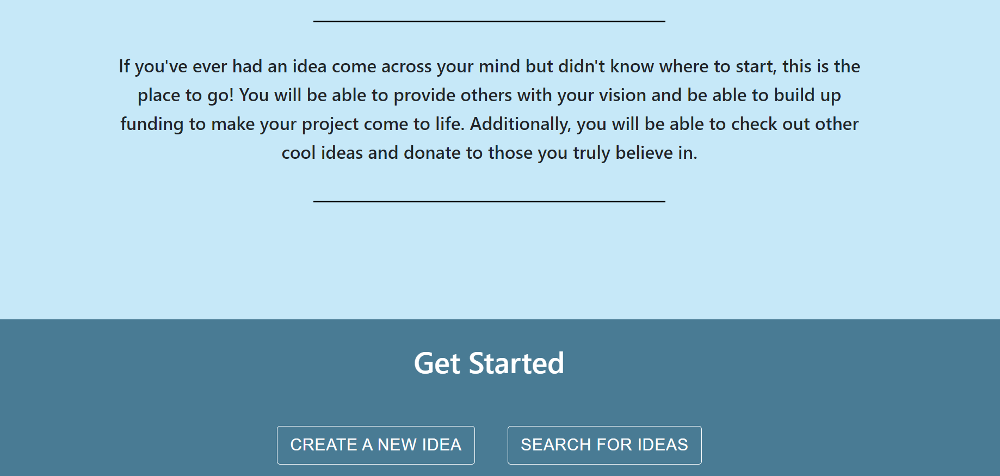
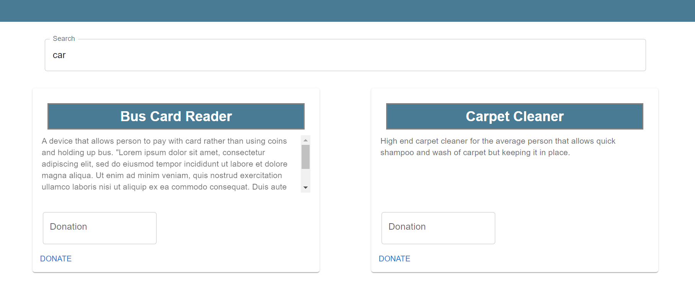

# Innovation Hub
This application will allow a user to post new product or service ideas, retrieve seed funding for their ideas, and donate to other ideas they believe in.

You can view this application at:
https://innovationhub1995.herokuapp.com/

**Note that this application uses Stripe test mode**. Please use Stripe Test Mode bank account and card when prompted.

Stripe Test Card Info:

    Number: 4242424242424242
    CVC: Any 3 digits
    Date: Any future date

More test card options are listed in the Features/Search Page section of this Readme.

## Prerequisites

1. Node.js

## Architecture

This application employs a Model-View-Controller (MVC) architecture.


## Getting started

Follow the below steps to get the application up and running on your local computer

```shell
git clone https://github.com/pmaganty/innovationhub.git
cd innovationhub
npm i
npm run start
```

Here is what you should expect from the above code:
1. Clone the github repository to your local area
2. Go into the repository directory
3. Install all dependencies using npm
4. Run the start script and open up localhost:3000 to see the application

## Developing

When developing the project further there are extra build compilation steps that must be taken.

### Front-end Development (Client Directory): 
If you only require testing of client directory (not backend usage), issue the below command.

```shell
npm run frontdev
```
This will open up a development server for you to view data from the client directory, but will not allow you to access any API calls. This is useful for styling purposes.

If you are testing the full environment, the client directory must be re-built after changes are made:

```shell
npm run frontbuild
```
### Back-end Development (Routes, Models, Controllers, server.ts): 

If you are developing the back-end (outside of the Client directory), you must recompile the typsescript before running the application:

```shell
npm run server
```

### For full environment build, compile, and render:

```shell
npm run dev
```
**See package.json for all scripts.**

## Features

Below are all of the possible routes a user can take on each page.

### Home Page

When the user is not signed in, the home page only allows the below.
1. Navigate to home 
2. Sign-in


When the user is signed in, the home page will allow the below:

1. Navigate to Home Page
2. Navigate to Create Page
3. Navigate to Search Page
4. Navigate to My Ideas Page




### Create Page

1. Create a new idea by inputing **first name**, **last name**, **title** of the idea, and **description** of the idea.

    * When the user hits submit, they will be **prompted to enter their bank account and business information through Stripe** so they can receive donations.
    * **Note that this is a Stripe Test Mode application** and payment information will not actually be saved. Stripe test bank should be used when prompted for bank information:
    

2. Navigate to Home Page
3. Navigate to Create Page
4. Navigate to Search Page
5. Navigate to My Ideas Page


### Search Page

1. Search for any existing ideas containing a phrase
2. Donate to an idea

    * When the user hits donate, they will be **prompted to enter their payment information through Stripe**.
    * **Note that this is a Stripe Test Mode application** and a Stripe test card must be used. Below is a list of test cards.
    
2. Navigate to Home Page
3. Navigate to Search Page
4. Navigate to Create Page
5. Navigate to My Ideas Page



### My Ideas Page

1. View all ideas associated with currently logged in user
2. Delete an idea associated with currently logged in user
3. See all donations associated with an idea
4. Navigate to Home Page
5. Navigate to My Ideas Page
6. Navigate to Search Page
7. Navigate to Create Page


## API Reference

Endpoint: **/api/ihub**

&nbsp;&nbsp;&nbsp;&nbsp;&nbsp;&nbsp;http route: *POST*

&nbsp;&nbsp;&nbsp;&nbsp;&nbsp;&nbsp;Description: Add a new idea

&nbsp;&nbsp;&nbsp;&nbsp;&nbsp; Inputs: 

&nbsp;&nbsp;&nbsp;&nbsp;&nbsp;&nbsp;&nbsp;&nbsp;&nbsp;&nbsp;&nbsp;&nbsp; BODY: Object of type {firstName: string, 
                            lastName: string, 
                            title: string, 
                            description: string, 
                            email: string,
                            user_id: string}

&nbsp;&nbsp;&nbsp;&nbsp;&nbsp; Response: JSON Object with empty rows key


&nbsp;&nbsp;&nbsp;&nbsp;&nbsp;&nbsp;http route: *PUT*

&nbsp;&nbsp;&nbsp;&nbsp;&nbsp;&nbsp;Description: Add stripe ID to idea

&nbsp;&nbsp;&nbsp;&nbsp;&nbsp; Inputs: 

&nbsp;&nbsp;&nbsp;&nbsp;&nbsp;&nbsp;&nbsp;&nbsp;&nbsp;&nbsp;&nbsp;&nbsp; BODY: Object of type {stripe_id: string | null, ideas_id: string | null}

&nbsp;&nbsp;&nbsp;&nbsp;&nbsp; Response: JSON Object with empty rows key

Endpoint: **/api/ihub/search**

&nbsp;&nbsp;&nbsp;&nbsp;&nbsp;&nbsp;http route: *GET*

&nbsp;&nbsp;&nbsp;&nbsp;&nbsp;&nbsp;Description: Get all ideas that match a search term

&nbsp;&nbsp;&nbsp;&nbsp;&nbsp; Inputs: 

&nbsp;&nbsp;&nbsp;&nbsp;&nbsp;&nbsp;&nbsp;&nbsp;&nbsp;&nbsp;&nbsp;&nbsp; PARAMETERS: Search Term: string

&nbsp;&nbsp;&nbsp;&nbsp;&nbsp; Response: JSON Object with rows key containing all database rows containing search term

Endpoint: **/onboard-user**

&nbsp;&nbsp;&nbsp;&nbsp;&nbsp;&nbsp;http route: *POST*

&nbsp;&nbsp;&nbsp;&nbsp;&nbsp;&nbsp;Description: Onboard user payment information to Stripe

&nbsp;&nbsp;&nbsp;&nbsp;&nbsp; Inputs: 

&nbsp;&nbsp;&nbsp;&nbsp;&nbsp;&nbsp;&nbsp;&nbsp;&nbsp;&nbsp;&nbsp;&nbsp; BODY: Object containing user email and associated idea id {email: string, id: number}

&nbsp;&nbsp;&nbsp;&nbsp;&nbsp; Response: JSON Object with empty rows key

Endpoint: **/stripeAccount**

&nbsp;&nbsp;&nbsp;&nbsp;&nbsp;&nbsp;http route: *GET*

&nbsp;&nbsp;&nbsp;&nbsp;&nbsp;&nbsp;Description: Get stripe account associated with stripe id

&nbsp;&nbsp;&nbsp;&nbsp;&nbsp; Inputs: 

&nbsp;&nbsp;&nbsp;&nbsp;&nbsp;&nbsp;&nbsp;&nbsp;&nbsp;&nbsp;&nbsp;&nbsp; PARAMETERS: Stripe ID: string

&nbsp;&nbsp;&nbsp;&nbsp;&nbsp; Response: Stripe Account object

Endpoint: **/api/ihub/stripeId/**

&nbsp;&nbsp;&nbsp;&nbsp;&nbsp;&nbsp;http route: *GET*

&nbsp;&nbsp;&nbsp;&nbsp;&nbsp;&nbsp;Description: Get stripe id associated with an idea

&nbsp;&nbsp;&nbsp;&nbsp;&nbsp; Inputs: 

&nbsp;&nbsp;&nbsp;&nbsp;&nbsp;&nbsp;&nbsp;&nbsp;&nbsp;&nbsp;&nbsp;&nbsp; PARAMETERS: Idea ID: number

&nbsp;&nbsp;&nbsp;&nbsp;&nbsp; Response: JSON Object with rows key containing relevant rows from database

Endpoint: **/create-checkout-session**

&nbsp;&nbsp;&nbsp;&nbsp;&nbsp;&nbsp;http route: *POST*

&nbsp;&nbsp;&nbsp;&nbsp;&nbsp;&nbsp;Description: Create payment method for user

&nbsp;&nbsp;&nbsp;&nbsp;&nbsp; Inputs: 

&nbsp;&nbsp;&nbsp;&nbsp;&nbsp;&nbsp;&nbsp;&nbsp;&nbsp;&nbsp;&nbsp;&nbsp; BODY: Object containing donation amount, stripe id of destination, title of the idea, and ID of idea {amount: number, stripe_id: number, title: string, idea_id: number}

&nbsp;&nbsp;&nbsp;&nbsp;&nbsp; Response: JSON Object with empty rows key

Endpoint: **/user**

&nbsp;&nbsp;&nbsp;&nbsp;&nbsp;&nbsp;http route: *GET*

&nbsp;&nbsp;&nbsp;&nbsp;&nbsp;&nbsp;Description: Get currently authenticated user

&nbsp;&nbsp;&nbsp;&nbsp;&nbsp; Inputs: 

&nbsp;&nbsp;&nbsp;&nbsp;&nbsp;&nbsp;&nbsp;&nbsp;&nbsp;&nbsp;&nbsp;&nbsp;

&nbsp;&nbsp;&nbsp;&nbsp;&nbsp; Response: JSON Object with rows key containing current user data

Endpoint: **/api/ihub/ideas/**

&nbsp;&nbsp;&nbsp;&nbsp;&nbsp;&nbsp;http route: *GET*

&nbsp;&nbsp;&nbsp;&nbsp;&nbsp;&nbsp;Description: Get all ideas associated with a user

&nbsp;&nbsp;&nbsp;&nbsp;&nbsp; Inputs: 

&nbsp;&nbsp;&nbsp;&nbsp;&nbsp;&nbsp;&nbsp;&nbsp;&nbsp;&nbsp;&nbsp;&nbsp; PARAMETERS: User ID: id: string

&nbsp;&nbsp;&nbsp;&nbsp;&nbsp; Response: JSON Object with rows key containing all database rows with given user ID

&nbsp;&nbsp;&nbsp;&nbsp;&nbsp;&nbsp;http route: *DELETE*

&nbsp;&nbsp;&nbsp;&nbsp;&nbsp;&nbsp;Description: Delete Idea

&nbsp;&nbsp;&nbsp;&nbsp;&nbsp; Inputs:

&nbsp;&nbsp;&nbsp;&nbsp;&nbsp;&nbsp;&nbsp;&nbsp;&nbsp;&nbsp;&nbsp;&nbsp; PARAMETERS: Idea ID: id: string

&nbsp;&nbsp;&nbsp;&nbsp;&nbsp; Response: JSON Object with empty rows key

Endpoint: **/api/ihub/stripeId/**

&nbsp;&nbsp;&nbsp;&nbsp;&nbsp;&nbsp;http route: *PUT*

&nbsp;&nbsp;&nbsp;&nbsp;&nbsp;&nbsp;Description: Update idea with donation

&nbsp;&nbsp;&nbsp;&nbsp;&nbsp; Inputs: 

&nbsp;&nbsp;&nbsp;&nbsp;&nbsp;&nbsp;&nbsp;&nbsp;&nbsp;&nbsp;&nbsp;&nbsp; PARAMETERS: Idea ID: string

&nbsp;&nbsp;&nbsp;&nbsp;&nbsp;&nbsp;&nbsp;&nbsp;&nbsp;&nbsp;&nbsp;&nbsp; BODY: Object of type {donation: number}

&nbsp;&nbsp;&nbsp;&nbsp;&nbsp; Response: JSON Object with empty rows key

Endpoint: **/api/ihub/donations/invalid/**

&nbsp;&nbsp;&nbsp;&nbsp;&nbsp;&nbsp;http route: *DELETE*

&nbsp;&nbsp;&nbsp;&nbsp;&nbsp;&nbsp;Description: Delete last donated amount on idea

&nbsp;&nbsp;&nbsp;&nbsp;&nbsp; Inputs: 

&nbsp;&nbsp;&nbsp;&nbsp;&nbsp;&nbsp;&nbsp;&nbsp;&nbsp;&nbsp;&nbsp;&nbsp; PARAMETERS: Idea ID: string

&nbsp;&nbsp;&nbsp;&nbsp;&nbsp; Response: JSON Object with empty rows key